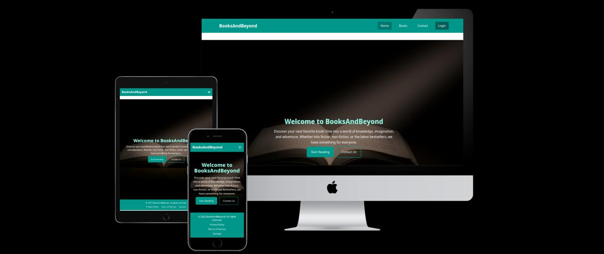

A **Full-Stack web application** where users can explore a variety of books, leave comments, and manage user authentication. Built using **Django Rest Framework (DRF)**, **React**, and **SQLite**, it follows **modern UX/UI and accessibility guidelines** while providing a **fully responsive design**.  
[Project Link](https://booksandbeyond-production.up.railway.app/) 

[Admin Panel](https://booksandbeyond-server-production.up.railway.app/admin/login/?next=/admin/) 

---

# 📖 BooksAndBeyond 

## 📜 Table of Contents
- [🌟 Project Overview](#-project-overview)
- - [🖥️ UX Design](#️-ux-design)
- [Database Planning](#database-planning)
- [Data Structure](#data-structure)
- [Wireframes](#wireframes)

- [🔄 Logic Flows](#-logic-flows) 
  - [Auth Logic](#auth-logic)
  - [Books Logic](#books-logic)
  - [Contact Logic](#contact-logic)
  
- [⚡ Agile Development](#-agile-development)
  - [Overview](#overview)
  - [User Stories](#user-stories)
  - [List of User Stories](#list-of-user-stories)
- [🎯 Features](#-features)
  - [Features Implemented](#features-implemented)
  - [Features Left to Implement](#features-left-to-implement)

- [🛠 Technology Stack](#-technology-stack)
  - [API](#api)
- [🧪 Testing](#-testing)
  - [Manual Testing](#manual-testing)
  - [Known Bugs and Issues](#known-bugs-and-issues)
- [🚀Deployment](#deployment)
- [📚 Resources](#-resources)
- [🙌 Credits & Acknowledgements](#-credits--acknowledgements)

---

# 🌟 Project Overview 

- Users can browse books, read descriptions, and leave comments.  
- Secure user auth 🔹 Admin Features  
✅ Manage books (Add, Update, Delete)  
✅ Moderate user comments  
✅ Monitor user activity  

[🔝 Back to Top](#-table-of-contents)

## 🖥️ UX Design  

## Database Planning
 
The database structure was planned using **Lucidchart** to visualize relationships between data models.  

## Data Structure  
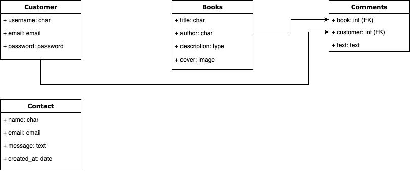

## Wireframes  
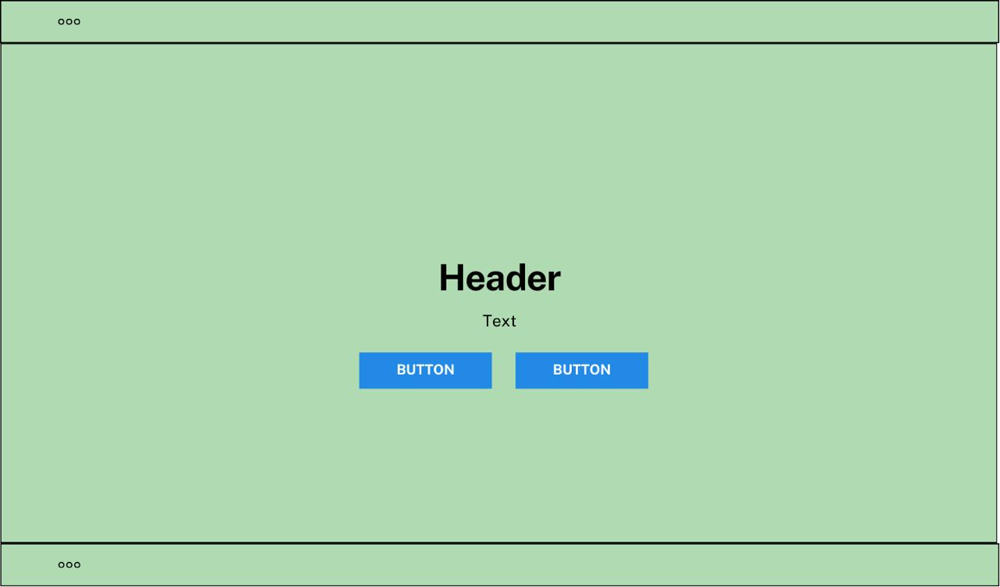

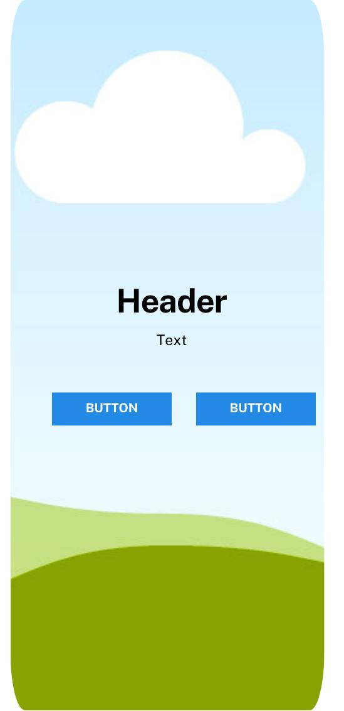

--
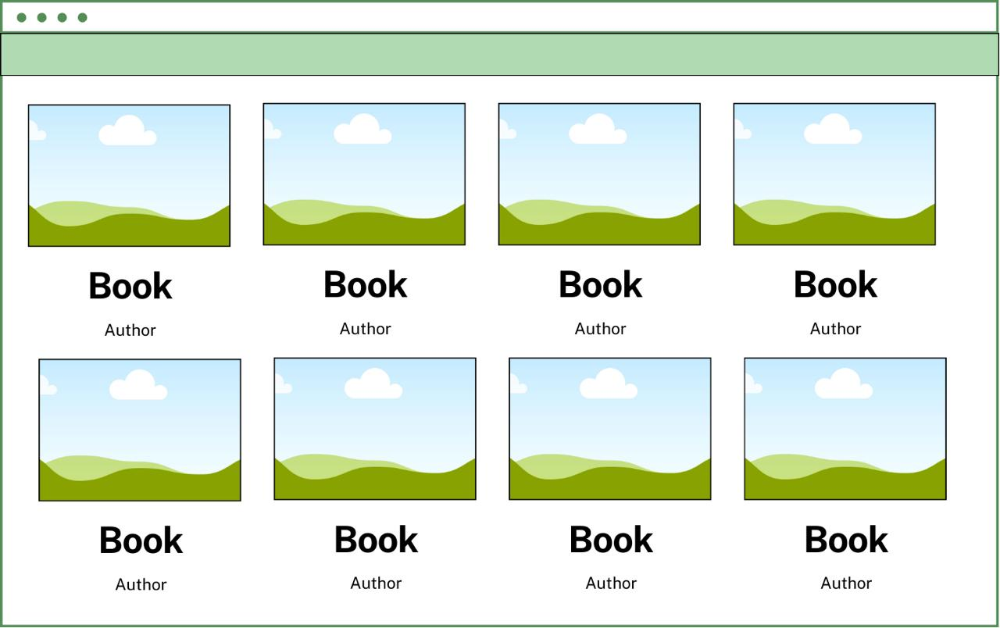

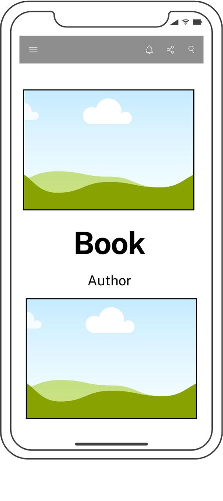

--
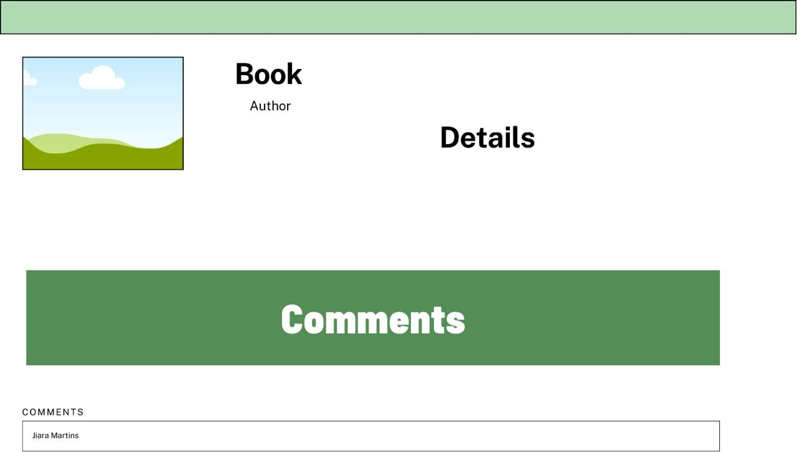

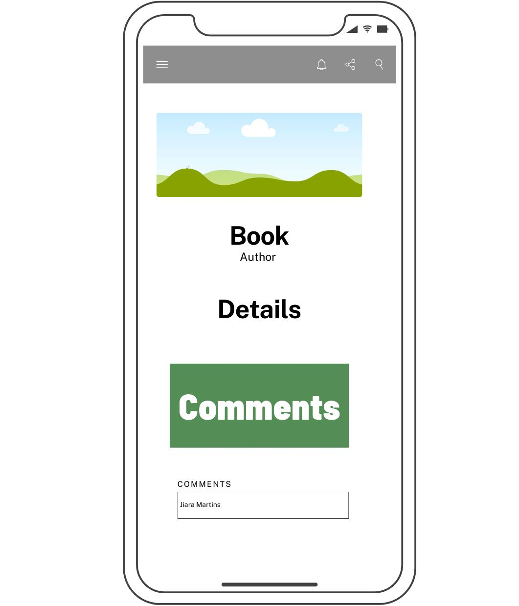

--
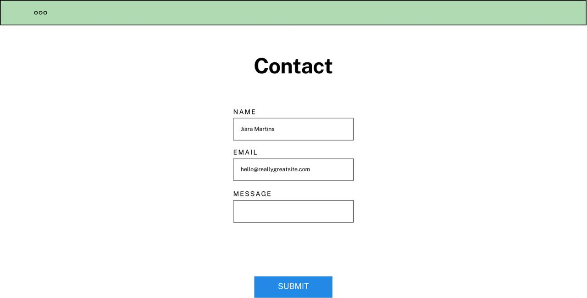

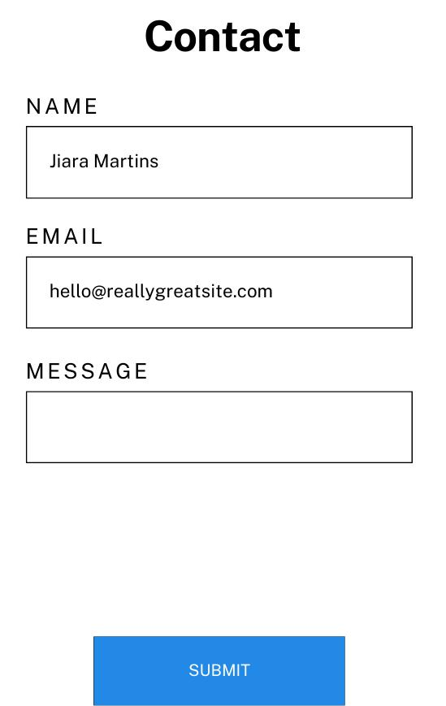

---

# 🔄 Logic Flows  

### 🔐Auth Logic 

## 1. Register Flow
**Purpose:** Allow users to create an account.

### Steps:
1. **Start** → User initiates a registration request.
2. **Validate registration data**:
   - Uses `CustomerRegistrationSerializer` to check fields (e.g., username, password, email).
3. **Is data valid?**  
   - **No** → Return `400 Bad Request` with validation errors (e.g., duplicate email, weak password).  
   - **Yes** → Proceed to the next step.
4. **Create user** → Save the validated data to the database.
5. **Return `201 Created`** (successful registration).

### Key Features:
- Public endpoint (no authentication required).
- Relies on Django REST Framework’s `CreateAPIView` for streamlined user creation.

## 2. Login Flow
**Purpose:** Authenticate a user and generate an access token.

### Steps:
1. **Start** → User submits credentials (e.g., username/password).
2. **Validate login data**:
   - Uses `LoginSerializer` to verify credentials.
3. **Is data valid?**  
   - **No** → Return `400 Bad Request` (e.g., invalid password, missing fields).  
   - **Yes** → Proceed to the next step.
4. **Fetch user** → Extract the validated user from the serializer.
5. **Get/Create token** → Generate a unique auth token (or reuse an existing one).
6. **Return `200 OK`** with the token (used for authenticated requests).

### Key Features:
- Token-based authentication (DRF’s Token model).
- Tokens persist until manually deleted (e.g., during logout).

## 3. Logout Flow
**Purpose:** Invalidate the user’s session by deleting their token.

### Steps:
1. **Start** → User sends a logout request.
2. **Check authentication**:  
   - **No** → Return `403 Forbidden` (unauthorized access).  
   - **Yes** → Proceed to the next step.
3. **Delete token** → Remove the user’s auth token (e.g., `request.user.auth_token.delete()`).
4. **Return `200 OK`** with a success message.

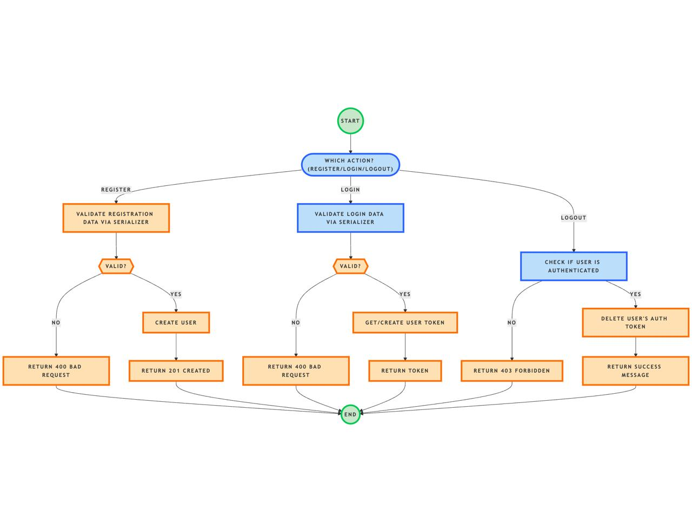

### 📚Books Logic  

1. Start
2. Retrieve book object by ID (from URL/path parameter)
3. Fetch all comments for the book (e.g., book.comments.all())
4. Serialize comments (using CommentSerializer)
5. Return 200 OK with serialized data → End

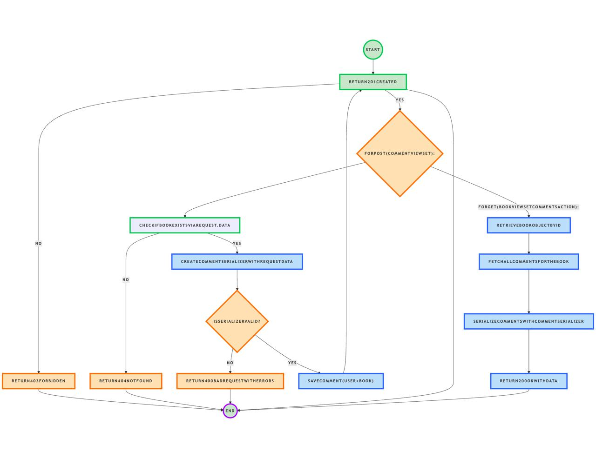

---

### 📩Contact Logic    

1. Start
2. Check request method:
3. POST:
4. Create serializer with request.data
5. Is serializer valid?
6. No:
7. Return 400 Bad Request (with errors) → End
8. Yes:
9. Save data (to database)
10. Return 201 Created → End
11. GET Flow (List Contacts)
12. Start
13. Check request method:
14. GET:
15. Fetch all contacts from the database
16. Serialize contacts data (using ContactSerializer)
17. Return 200 OK (with serialized data) → End

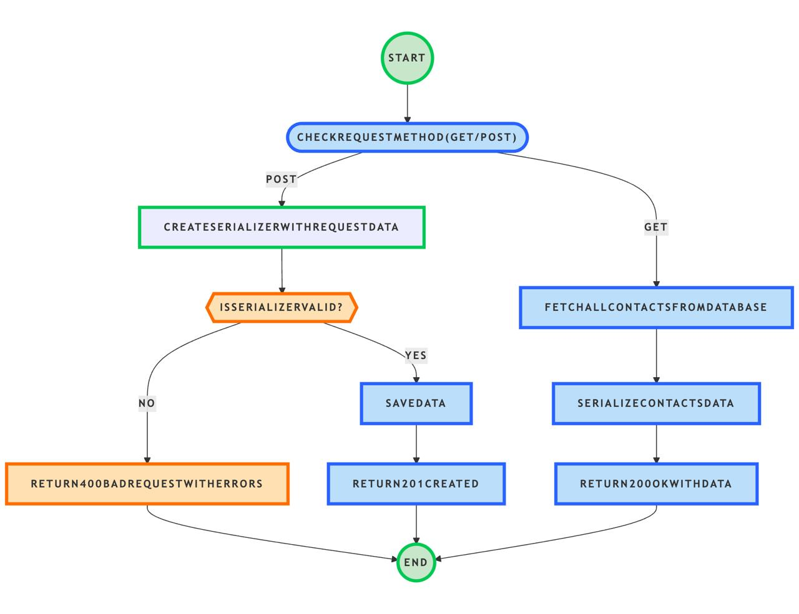

[🔝 Back to Top](#-table-of-contents)

---

## ⚡ Agile Development  

### 📌Overview 

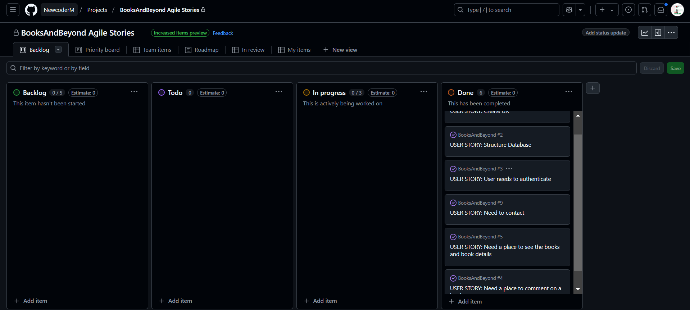

To ensure smooth project management, I utilized **Agile methodology** along with a **Kanban board** in GitHub Projects. This approach helped in tracking progress, managing tasks, and ensuring timely completion of features.  

- **Epics & User Stories:** The project was broken down into **user stories** to prioritize development.  
- **Task Breakdown:** Each user story was divided into smaller **tasks** for better tracking and completion.  
- **Iterative Development:** Features were implemented in **sprints**, allowing continuous improvement.  

To see the project's **Kanban board**, [click here](https://github.com/users/NewcoderM/projects/3/views/1).  

---
  
### 📌User Stories

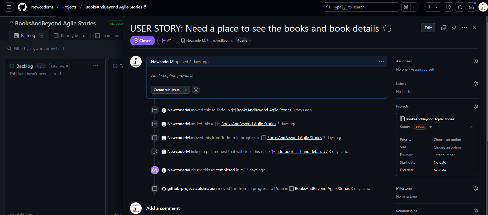

To build a user-centric product, I stepped into the shoes of future users and identified essential features and functionalities. This led to the creation of **12 User Stories**:  
- **6 Mandatory** stories, providing core functionality.  

Each **User Story** included:  
- **Acceptance Criteria**  
- **Bite-sized Tasks** for easy tracking  
- **Bug Tracking & Comments** to document issues and solutions  

As tasks were completed, user stories moved from **"In Progress"** to **"Completed"** in the Kanban workflow.

---

### 📋List of User Stories  

#### ✅ **Mandatory User Stories**  
1. **USER STORY: User needs to authenticate**  
2. **USER STORY: Need to contact**  
3. **USER STORY: Need a place to see the books and book details**  
4. **USER STORY: Need a place to comment on a book**  
5. **USER STORY: Structure Database**  
6. **USER STORY: Create UX**  

[🔝 Back to Top](#-table-of-contents)
---

## 🎯 Features 

### 🔹 User Features  
✅ View a collection of books  
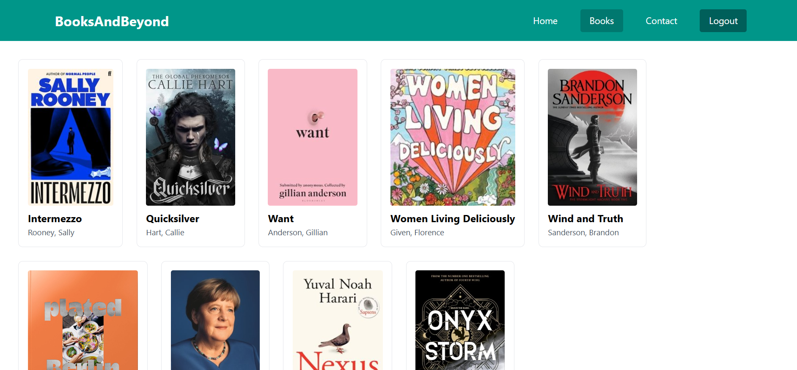

✅ Read details about each book  
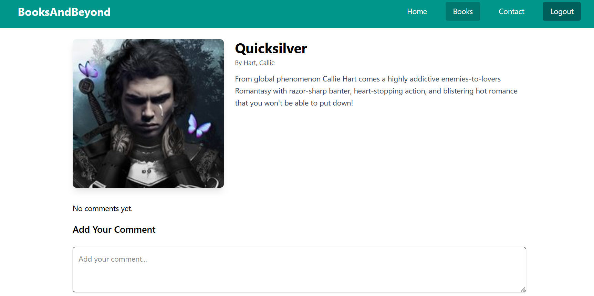

✅ Leave comments on books  
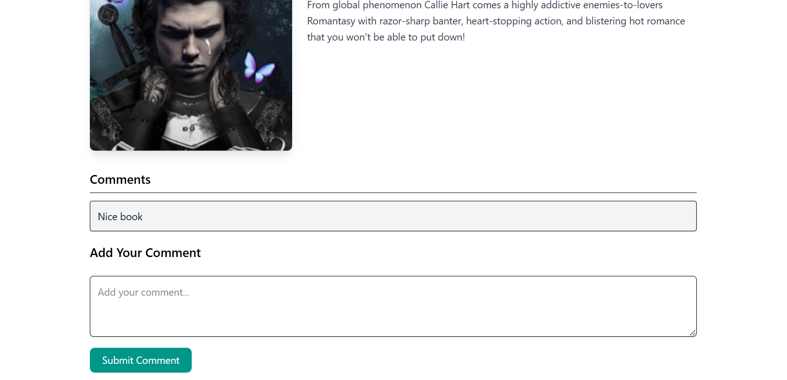

✅ Secure **Login & Logout** system  
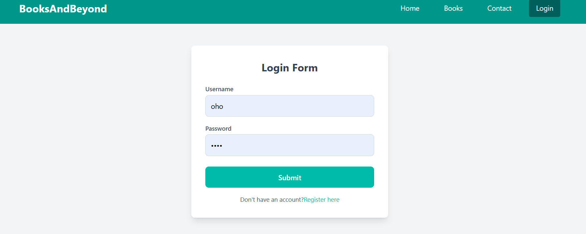

### 🔹 Admin Features  
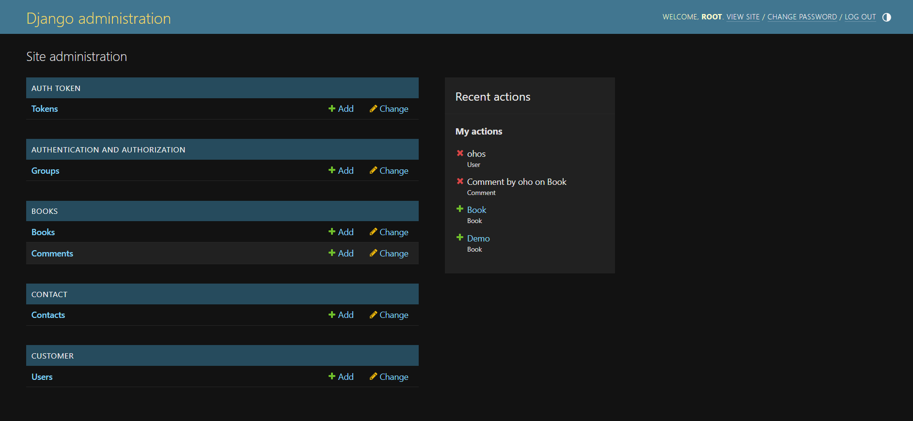

✅ Manage Books
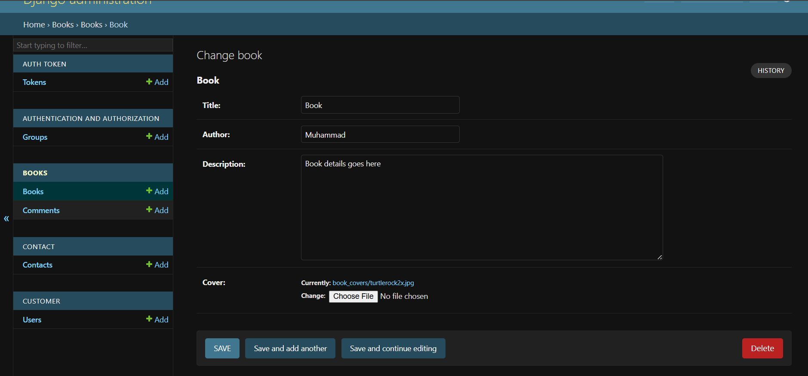

✅ See Users
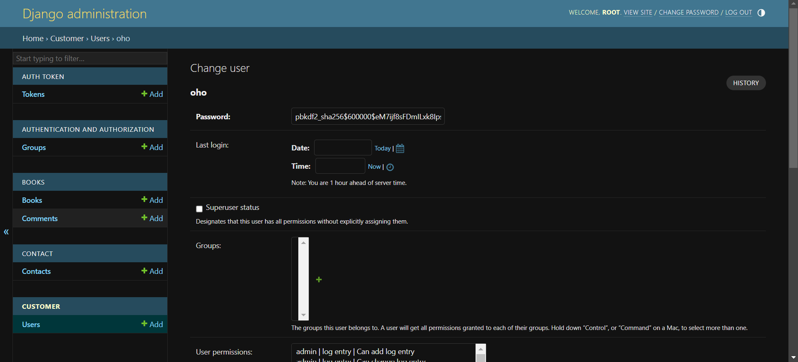

---

[🔝 Back to Top](#-table-of-contents)

---

## 🚀Features Implemented

Each **User Story** contributed to the following implemented features:

### 🔐 **Authentication System**  
- Implemented **user authentication** allowing users to **sign up, log in, and log out** securely.  
- Integrated **password hashing and session management** for security.  
- Ensured proper **authorization**, restricting access to certain features based on authentication status.  
- Utilized **CSRF protection** and security best practices.  

(*Related to:* `USER STORY: User needs to authenticate`)  

---

### 📩 **Contact Page**  
- Created a **dedicated contact page** for users to send inquiries.  
- Integrated **a form submission system** to collect messages from users.  
- Provided **email or backend processing** for handling contact requests.  

(*Related to:* `USER STORY: Need to contact`)  

---

### 📚 **Books and Book Details Page**  
- Designed a **books listing page** showcasing available books.  
- Each book has a **detailed page**, including title, author, description, and other metadata.  
- Implemented **search and filter functionality** for an improved user experience.  

(*Related to:* `USER STORY: Need a place to see the books and book details`)  

---

### 💬 **Book Commenting System**  
- Users can **leave comments** on book pages.  
- Implemented **comment moderation features**, ensuring appropriate content.  
- Comments are displayed in a structured manner, showing user details and timestamps.  

(*Related to:* `USER STORY: Need a place to comment on a book`)  

---

### 🗄️ **Database Structure & Optimization**  
- Designed and structured the **database schema** efficiently.  
- Created **tables/models** for users, books, comments, and related data.  
- Optimized **relationships and indexing** for performance.  

(*Related to:* `USER STORY: Structure Database`)  
--

### 🎨 **User Experience (UX) Enhancements**  
- Developed an intuitive **UI/UX** for seamless navigation.  
- Ensured **responsive design** for desktop and mobile users.  
- Used **modern styling frameworks** to enhance aesthetics and usability.  

(*Related to:* `USER STORY: Create UX`)  

[🔝 Back to Top](#-table-of-contents)

## Features Left to Implement

I have several enhancements planned to improve the platform's functionality and user experience. Here are some key features that I intend to implement in future updates:

Comment Management – Allow users to delete and edit their own comments for better interaction control.
Profile Enhancements – Enable users to update their profile details, including changing their username, profile picture, and password.
Notifications System – Implement in-app or email notifications for replies to comments, new book additions, and important updates.
Advanced Search & Filtering – Improve book discovery with filters for categories, authors, and user ratings to make navigation easier.
Bookmark & Reading List – Allow users to save books to a personal reading list and track their progress.
User Roles & Permissions – Introduce different roles, such as moderators, to help manage content and maintain community guidelines.
Dark Mode – Add a dark mode option for a better reading experience in low-light environments.
Review & Rating System – Enhance community engagement by allowing users to rate books and leave structured reviews.
These features will significantly enhance the platform, making it more interactive, user-friendly, and feature-rich. Stay tuned for future updates! 🚀

[🔝 Back to Top](#-table-of-contents)
---

## 🛠 Technology Stack  
| **Technology** | **Purpose** |
|---------------|------------|
| **Django Rest Framework (DRF)** | Backend API |
| **React** | Frontend UI |
| **SQLite** | Database |
| **JWT Authentication** | Secure user login/logout |
| **Tailwind** | Responsive design |
| **Fetch** | API requests from React |
| **React Router** | Navigation between pages |
| **Railway** | Deployment platform for hosting backend and frontend |

[🔝 Back to Top](#-table-of-contents)
---

## 📌API 

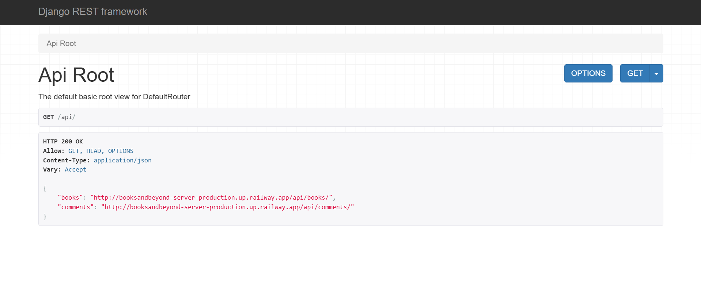

[Link](https://booksandbeyond-server-production.up.railway.app/api/)

Why I feel API-based architecture (DRF) is better than traditional Django views?  

Instead of using **traditional Django views**, we opted for a **RESTful API using DRF**. Here’s why:  

1️⃣ **Separation of Concerns**  
   - The **backend (DRF)** handles data logic, while **React** focuses on UI.  
   - Makes code **more modular and maintainable**.  

2️⃣ **Scalability**  
   - APIs can serve multiple frontends (Web, Mobile, etc.).  
   - A **React frontend can be easily replaced or updated** without touching the backend.  

3️⃣ **Performance**  
   - DRF allows for **optimized data retrieval** using serialization.  
   - Reduces **redundant database queries** compared to traditional Django templates.  

4️⃣ **Security**  
   - **JWT authentication** ensures secure login across devices.  
   - **CORS handling** protects the API from unauthorized access.  

🎥 **[I was influenced by this video](https://www.youtube.com/watch?v=ufgjBJa2M70)**

[🔝 Back to Top](#-table-of-contents)

---

## 🧪 Testing

### 📱 Responsiveness  
Testing was conducted on multiple devices, including a **Lenovo Ideapad Laptop** and a **Samsung Galaxy A5**, using the latest versions of **Google Chrome, Mozilla Firefox, and Opera**. For more detailed testing, **Google DevTools** was used to simulate different screen sizes.  

#### **Tested Pages**  
- **Home Page** ✅  

- **Books Page** ✅  
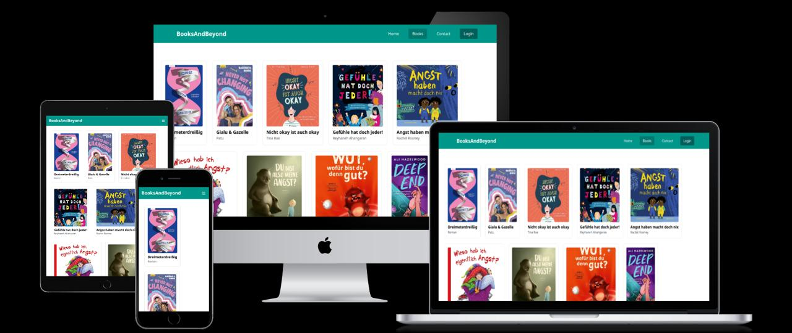
- **Book Details Page** ✅  
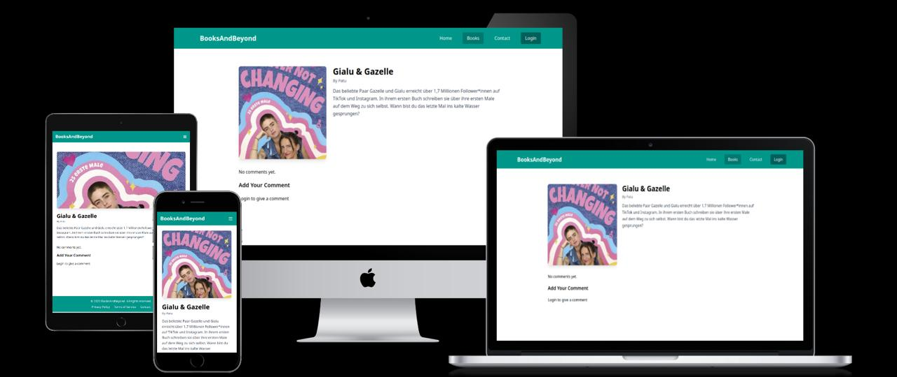
- **Contact Page** ✅  
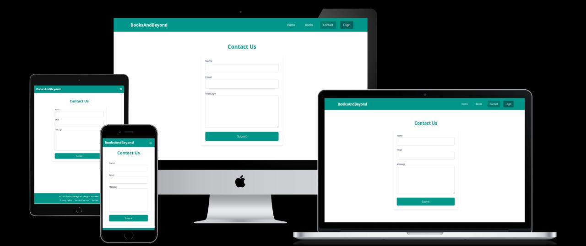
---

### ✅Manual Testing  

#### **Account Registration Tests**  
| Test | Result |
|------|--------|
| User can create a profile | ✅ Pass |
| User can log into profile | ✅ Pass |
| User can log out of profile | ✅ Pass |
| Comments are displaying correctly | ✅ Pass |
| Comments are dismissable by button and timeout | ✅ Pass |

#### **User Navigation Tests**  
| Test | Result |
|------|--------|
| User can easily navigate to the books section | ✅ Pass |
| User can access the Contact page | ✅ Pass |s |
| User can comment on a book | ✅ Pass |
| SuperUser can access the admin page | ✅ Pass |

#### **Account Authorization Tests**  
| Test | Result |
|------|--------|
| Only SuperUser can access the admin panel | ✅ Pass |
| Non-authorized users cannot access profile page | ✅ Pass |
| Non-authorized users cannot comment on a book | ✅ Pass |

#### **Book & Profile Management Tests**  
| Test | Result |
|------|--------|
| User can view all available books | ✅ Pass |
| User can view book details | ✅ Pass |
| User can leave a comment on a book | ✅ Pass |
| User can edit their profile details | ✅ Pass |
| User can delete their profile | ✅ Pass |
| Confirmation messages appear after successful actions | ✅ Pass |

#### **Admin Panel Tests**  
| Test | Result |
|------|--------|
| Items display correctly when updated/added | ✅ Pass |
| Admin can approve or delete user comments | ✅ Pass |

---

### 🐞Known Bugs and Issues  
- 🔹 **Minor UI Issue:** Some elements may slightly misalign on very small screens.  
- 🔹 **Button Styling Issue:** A green submit button is automatically generated by the form system and does not follow the custom styling.  
- 🔹 **Past Booking Prevention:** The function that prevents users from selecting past dates for a booking is not fully working. However, admins can still verify and reject such bookings manually.  

**📌 Note:** These bugs do not affect core functionality and will be addressed in future updates.  

[🔝 Back to Top](#-table-of-contents)

# 🚀Deployment

I deployed my fullstack Django + React project on [Railway](https://railway.app/). I chose Railway over Heroku because SQLite (which I used for my database) is not well-suited for Heroku's ephemeral filesystem.

---

## Why I Chose Railway

- *Persistent Storage*: Unlike Heroku, which resets its filesystem on every deploy, Railway provides persistent storage, making it suitable for SQLite.
- *Easy Deployments*: Railway allows seamless deployments for both backend and frontend in a single project.
- *Built-in Database Support*: While I used SQLite for simplicity, Railway also supports PostgreSQL, MySQL, and more.

---

## 1. Setting Up My Railway Project

1. Signed up at [Railway](https://railway.app/).
2. Clicked "New Project" and chose *Deploy from GitHub*.
3. Connected my GitHub repository.

---

## 2. Deploying My Backend (Django)

### 2.1 Setting Up Procfile
I created a Procfile in my Django project root:

sh
echo 'web: gunicorn myproject.wsgi' > Procfile

### 2.2 Installing Dependencies
I ensured my requirements.txt had the necessary dependencies:

txt
gunicorn
django
django-cors-headers
djangorestframework
dotenv

### 2.3 Configuring settings.py
I modified settings.py:

python
import os
import dj_database_url

DEBUG = False
ALLOWED_HOSTS = ['*']

DATABASES = {
    'default': {
        'ENGINE': 'django.db.backends.sqlite3',
        'NAME': os.path.join(BASE_DIR, 'db.sqlite3'),
    }
}

### 2.4 Adding Static Files Support

python
STATIC_ROOT = os.path.join(BASE_DIR, 'staticfiles')
STATIC_URL = '/static/'

Then, I ran:

sh
python manage.py collectstatic

### 2.5 Deploying the Backend
I committed the changes and pushed them to GitHub. Then, in Railway:

1. Added a new service → *GitHub Repo* → Selected backend.
2. Set PYTHON_VERSION=3.9 in *Variables*.
3. Set RAILWAY_STATIC_URL for static files (if needed).
4. Clicked *Deploy*.

---

## 3. Deploying My Frontend (React)

### 3.1 Building My React App

I ensured package.json had:

json
"scripts": {
  "build": "react-scripts build"
}

Then, I ran:

sh
npm install
npm run build

### 3.2 Serving React with Django
I moved the build/ folder to Django’s static/:

sh
mv build/ myproject/static/

Then, I updated Django urls.py:

python
from django.views.generic import TemplateView
urlpatterns += [
    path('', TemplateView.as_view(template_name='index.html')),
]

### 3.3 Deploying the Frontend
I committed the changes and pushed them to GitHub. Then, in Railway:

1. Added a new service → *GitHub Repo* → Selected frontend.
2. Set NODE_ENV=production.
3. Clicked *Deploy*.

---

## 4. Final Steps

### 4.1 Migrating My Database
In Railway, I opened the *backend terminal* and ran:

sh
python manage.py migrate

### 4.2 Creating a Superuser

sh
python manage.py createsuperuser

## 🎉 Deployment Completed!
My Django + React app is now live on Railway! 🚀

[🔝 Back to Top](#-table-of-contents)

---

## 📚 Resources  
- **[Django Rest Framework Docs](https://www.django-rest-framework.org/)**  
- **[React Docs](https://reactjs.org/)**  
- **[Railway Deployment Guide](https://docs.railway.app/)**  

----

## 🙌 Credits & Acknowledgements  

This project was made possible through the collective efforts of various open-source communities, online learning platforms, and helpful resources. Special thanks to the following:

### 🔹 **YouTube Tutorials & Guides**  
1. [Django Rest Framework Full Course](https://www.youtube.com/watch?v=ufgjBJa2M70)  
2. [React & Django Integration](https://www.youtube.com/watch?v=4F2m91eKmts)  
3. [Building a Full-Stack App](https://www.youtube.com/watch?v=mrHNSanmqQ4)  
4. [Django Authentication System](https://www.youtube.com/watch?v=eBsc65jTKvw)  
5. [React Hooks & State Management](https://www.youtube.com/watch?v=6ThXsUwLWvc)  
6. [Tailwind CSS for Beginners](https://www.youtube.com/watch?v=F4xZ7XVdU1A)  
7. [React Router Explained](https://www.youtube.com/watch?v=Law7wfdg_ls)  
8. [JWT Authentication in Django](https://www.youtube.com/watch?v=F8PRrnc5MyY)  
9. [SQLite Database Optimization](https://www.youtube.com/watch?v=2LyzBoHo5EI)  
10. [Deploying Django + React on Railway](https://www.youtube.com/watch?v=WpFL7kZ-c9g)  
11. [Best UX/UI Practices](https://www.youtube.com/watch?v=_Q-FQsJpU-I)  
12. [Kanban Board & Agile Development](https://www.youtube.com/watch?v=R8dYLbJiTUE)  

### 🔹 **Development & Learning Platforms**  
- [Django Rest Framework Official Docs](https://www.django-rest-framework.org/)  
- [React Official Documentation](https://react.dev/)  
- [SQLite Documentation](https://www.sqlite.org/docs.html)  
- [Railway Deployment Docs](https://docs.railway.app/)  
- [MDN Web Docs](https://developer.mozilla.org/en-US/)  
- [W3Schools](https://www.w3schools.com/)  

### 🔹 **Tools & Libraries Used**  
- **Django & DRF** for backend development  
- **React & React Router** for frontend development  
- **Tailwind CSS** for responsive UI  
- **JWT Authentication** for secure user management  
- **Lucidchart** for database planning  
- **GitHub Projects** for task tracking  
- **Google DevTools** for testing  

### 🔹 **Special Thanks**  
A huge thank you to my mentor Spencer Barriball, a person who always dedicated time to help me and not just even in live meetings but also through Slack the whole time.
Another thank you to Prolet in StudentsCare who was a real help answering to my inquiries and helping with giving me the proper prolonging papers when I got sick. And to all the people in CodeInstitue who are working on supporting me and my fellow learners,..Thank you.

[🔝 Back to Top](#-table-of-contents)
